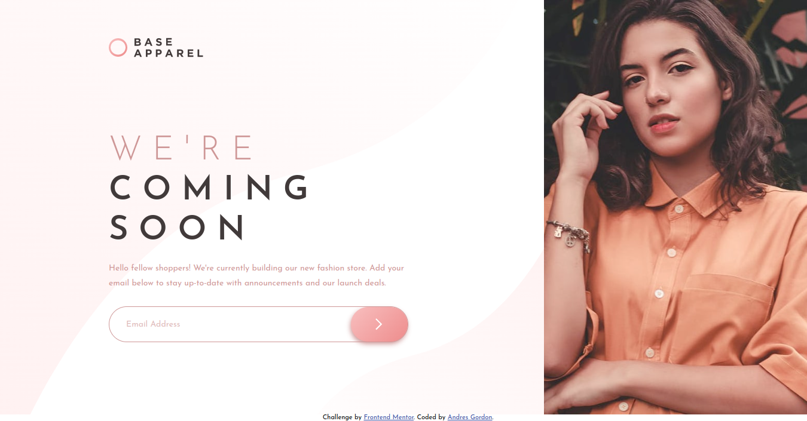

# Frontend Mentor - Base Apparel coming soon page solution

This is a solution to the [Base Apparel coming soon page challenge on Frontend Mentor](https://www.frontendmentor.io/challenges/base-apparel-coming-soon-page-5d46b47f8db8a7063f9331a0). Frontend Mentor challenges help you improve your coding skills by building realistic projects. 

## Table of contents

- [Overview](#overview)
  - [The challenge](#the-challenge)
  - [Screenshot](#screenshot)
  - [Links](#links)
- [My process](#my-process)
  - [Built with](#built-with)
  - [What I learned](#what-i-learned)
  - [Continued development](#continued-development)
  - [Useful resources](#useful-resources)
- [Author](#author)

## Overview

### The challenge

Users should be able to:

- View the optimal layout for the site depending on their device's screen size
- See hover states for all interactive elements on the page
- Receive an error message when the `form` is submitted if:
  - The `input` field is empty
  - The email address is not formatted correctly

### Screenshot



### Links

- Solution URL: [github.com/andresgrdn/base-apparel-coming-soon](https://github.com/andresgrdn/base-apparel-coming-soon)
- Live Site URL: [andresgrdn.github.io/base-apparel-coming-soon/](https://andresgrdn.github.io/base-apparel-coming-soon/)

## My process

### Built with

- Semantic HTML5 markup
- CSS custom properties
- Flexbox
- CSS Grid
- Mobile-first workflow
- Javascript

### What I learned

Use this section to recap over some of your major learnings while working through this project. Writing these out and providing code samples of areas you want to highlight is a great way to reinforce your own knowledge.

To see how you can add code snippets, see below:

```js
const proudOfThisFunc = () => {
  console.log('🎉')
}
```

### Continued development

Use this section to outline areas that you want to continue focusing on in future projects. These could be concepts you're still not completely comfortable with or techniques you found useful that you want to refine and perfect.

### Useful resources

- [height property | MDN docs](https://developer.mozilla.org/en-US/docs/Web/CSS/height#:~:text=Percentages,initial%20containing%20block.) - This help me when I have troubles with sizing an image whit respect to the parent element.
- [form docs | MDN docs](https://developer.mozilla.org/en-US/docs/Web/HTML/Element/form) - This is an amazing article which helped me understand how to use the form element.
- [letter spacing docs | MDN docs](https://developer.mozilla.org/en-US/docs/Web/CSS/letter-spacing#:~:text=to%20justify%20text.-,%3Clength%3E,-Specifies%20extra%20inter) - From this article I learn to spacing letters from the styling file.
- [background image drawing order | CSSWG drafts](https://drafts.csswg.org/css-backgrounds/#background-image:~:text=This%20property%20sets%20the%20background%20image(s)%20of%20an%20element.%20Images%20are%20drawn%20with%20the%20first%20specified%20one%20on%20top%20(closest%20to%20the%20user)%20and%20each%20subsequent%20image%20behind%20the%20previous%20one.) - I could fixed an issue with the hover pseudo class on the submit button. When hover the button wasn't changing the background gradient.
- [picture element | MDN docs](https://developer.mozilla.org/en-US/docs/Web/HTML/Element/picture) - On this page I learned about responsive image loading, The picture  element allows to load different images for different viewport sizes, using the meta attribute.

## Author

- Website - [Andres Gordon](https://andresgrdn.github.io)
- Frontend Mentor - [@andresgrdn](https://www.frontendmentor.io/profile/andresgrdn)
- Twitter - [@andresgrdn](https://www.twitter.com/andresgrdn)
